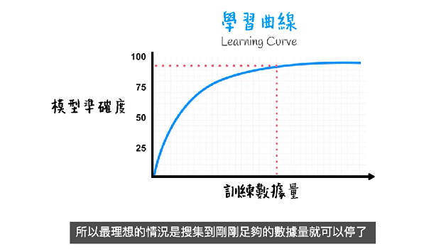

# Video Embedded Subtitles to SBV

Extract hardcoded subtitles from a video file and save them as a SBV plain text file.

The SBV file may be uploaded to YouTube to supplement your video.


## Get started

```bash
sudo apt update
sudo apt install tesseract-ocr-chi-tra

git clone [URL of this repository]
cd video2sbv

python3 -m venv .venv
source .venv/bin/activate
pip install --upgrade pip
pip install pillow pytesseract opencv-python-headless tqdm
```


## Run

```bash
python main.py ./video_example.mp4 ./subtitles.sbv --separator 0.87
```
* ```./sample_video.mp4``` is the input video file example included in this project for testing purpose. Please replace with your own video file. You may self-define the file path and name.
* ```./subtitles.sbv``` is the output subtitle text file.
* ```--separator 0.87``` defines the position of the horizontal line separating the subtitles, in fraction of video height.
* You may add ```--lang xxx``` to change the subtitle language to be detected (default is Traditional Chinese). But you need to install the corresponding library package other than ```tesseract-ocr-chi-tra```

Screen shot of the input ```sample_video.mp4```:



The output ```subtitles.sbv``` looks like:
```
0:00:00.000,0:00:00.375
同理，對機器學習來說，數據越多，建構的模型就越能模擬真實

0:00:00.375,0:00:04.166
訓練數據量與模型準確度的關係是這樣的

0:00:04.166,0:00:07.500
這是模型的學習曲線(tegrningcurve)

0:00:07.500,0:00:14.000
訓練數據越多模型自然越準，而準到一定程度時，數據再多也沒有明顯分別

0:00:14.000,0:00:19.000
所以最理想的情況是搜集到剛剛足夠的數據量就可以停了
```
* Please check the result because the AI is not perfect. E.g. in the above example, ```tegrningcurve``` should be ```learning curve```.